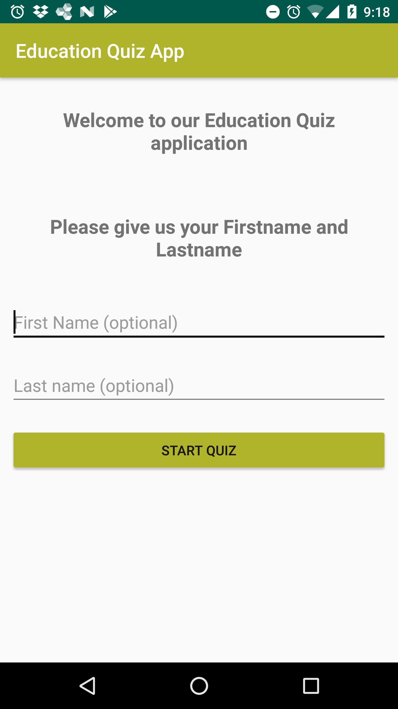

Education quiz app
===================================
This app makes an inquiry into the progress of your child in college. It lets you know if your needs a particular follow-up, needs attention, etc.

This project is part of the training projects of udacity nanodegree

Below are some screenshot of the look of the application on device.

# Start screen

# Quiz 3 screen

# Quiz 4 screen

# Result screen

Pre-requisites
--------------

- Android SDK v24
- Android Build Tools v24.0.2
- Android Support Repository v24.2.0

